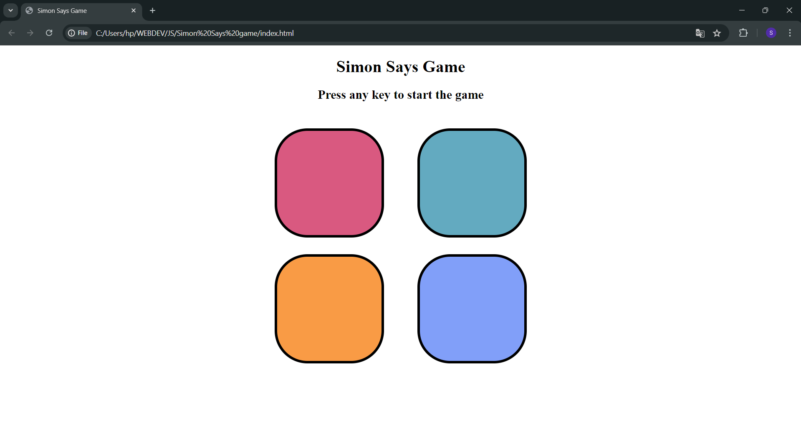

# Simon Says Game

Welcome to the Simon Says Game repository! This project is a recreation of the Simon Says Game to showcase HTML, CSS, and JavaScript skills.
A fun and interactive Simon Says game created using HTML, CSS, and JavaScript.

## Screenshots

## Description

Simon Says is a classic memory game where players must repeat a sequence of colors in the correct order. This project is a web-based version of the game, designed to be simple and engaging.

## Features

- Interactive and responsive design
- Randomly generated sequences
- Increasing difficulty with each level
- Sound effects for a better gaming experience

## Technologies Used

- HTML5: Markup language for structuring the content of the web page.
- CSS3: Styling language used to define the layout, colors, and typography of the page.
- JavaScript (optional): Used to add interactivity and dynamic behavior to the page.
- Git: Version control system for tracking changes to the project files.
- GitHub Pages: Hosting service for deploying the landing page and making it accessible online.

## Contributing

Contributions are welcome! If you have any suggestions or improvements, please feel free to submit a pull request. 

1. Fork the repository
2. Create a new branch (`git checkout -b feature-branch`)
3. Make your changes
4. Commit your changes (`git commit -m 'Add some feature'`)
5. Push to the branch (`git push origin feature-branch`)
6. Open a pull request

# Live Project Link 
To play simon says game please [click here](https://saurabh-helwade.github.io/Simon-Says-Game/) and enjoy the game.
